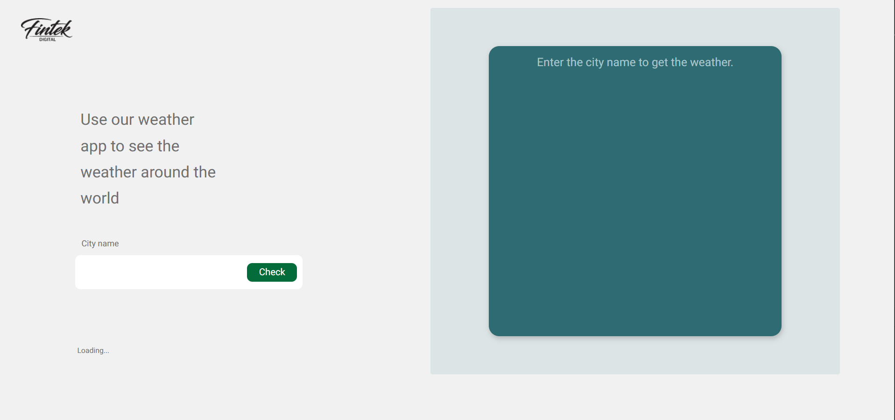
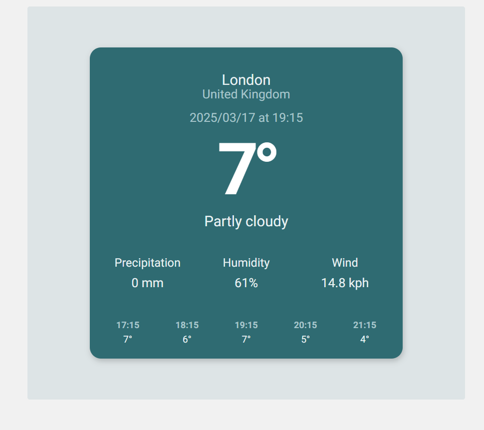

# Weather App 🌤️

## Overview

This is a full-stack weather application built with **React.js** for the frontend and **Node.js + Express** for the backend.  
The app allows users to enter a city name and get real-time weather updates, along with past and future weather data (1-2 hours before and after the current time).

## Features

- 🌎 **City-based weather search**
- 📊 **Current, past (1-2 hours ago), and future (1-2 hours ahead) weather updates**
- 📍 **Displays latitude and longitude of the searched city**
- 🌡️ **Shows temperature, humidity, wind speed, and precipitation**
- ⏳ **Timezone-based accurate weather data**
- 🎨 **Responsive design with CSS styling**
- 🔄 **Uses Context API for state management**
- 🌐 **Fetches data from an external weather API**

## Screenshots

Here are some screenshots of the application:


*The homepage with the search input field*


*Weather details for a searched city*

---

## Installation and Setup

### Prerequisites

Make sure you have the following installed:

- **Node.js** (v14 or later)
- **npm** 
- A valid API key from **WeatherAPI.com**

### Clone the Repository

```sh
git clone https://github.com/margalitWeiss/project.git
cd project
Backend Setup
Navigate to the backend directory:
sh
Copy
Edit
cd backend
Install dependencies:
sh
Copy
Edit
npm install
Create a .env file in the backend folder and add your WeatherAPI key:
ini
Copy
Edit
PORT=5500
API_KEY=12baea7a28a44265948161450250903
Start the backend server:
sh
Copy
Edit
npm start
Frontend Setup
Navigate to the frontend directory:
sh
Copy
Edit
cd frontend
Install dependencies:
sh
Copy
Edit
npm install
Start the frontend:
sh
Copy
Edit
npm start
Project Structure
pgsql
Copy
Edit
project/
│── backend/
│   ├── Routers/
│   │   ├── weather.js
│   ├── controllers/
│   │   ├── weather.js
│   ├── services/
│   │   ├── weatherervice.js
│   ├── .env
│   ├── server.js
│── frontend/
│   ├── src/
│   │   ├── component/
│   │   │   ├── CitySearch.jsx
│   │   │   ├── WeatherDisplay.jsx
│   │   │   ├── CityDetails.jsx
│   │   ├── context/
│   │   │   ├── CityContext.js
│   │   │   ├── CityDataContext.js
│   │   ├── api/
│   │   │   ├── weatherServices.js
│   │   ├── assets/
│   │   │   ├── logo/
│   │   │   ├── styles/
│   │   │   │   ├── CitySearch.css
│   │   │   │   ├── WeatherDisplay.css
│   │   │   │   ├── CityDetails.css
│   │   ├── App.js
│   │   ├── index.js
│── images/
│── README.md
Technologies Used
Frontend 🖥️
React.js (Hooks & Context API)
CSS (custom styling)
Axios (for API calls)
Moment.js (for date/time formatting)
Backend ⚙️
Node.js
Express.js
Axios (for fetching weather data)
dotenv (for environment variables)
CORS (for handling cross-origin requests)
API Usage
This project fetches weather data from WeatherAPI.com.
Example API request:

sh
Copy
Edit
http://api.weatherapi.com/v1/forecast.json?key=12baea7a28a44265948161450250903&q=London&hours=24
How It Works 🛠️
User enters a city name in the input field and clicks "Check."
City name is passed to the backend, which calls the WeatherAPI.
Backend returns weather data, including:
Current weather
Temperature history (1-2 hours ago)
Temperature forecast (1-2 hours ahead)
Frontend displays the weather details and updates the UI dynamically.
Future Improvements 🚀
🌍 Add a map to display the searched city's location
🌑 Dark mode for better UI experience
🌡️ Add weekly weather forecasts
📱 Improve mobile responsiveness
Contributing 🤝
Want to improve this project? Feel free to fork the repo and submit a pull request!

License 📜
This project is licensed under the MIT License. See the LICENSE file for details.

